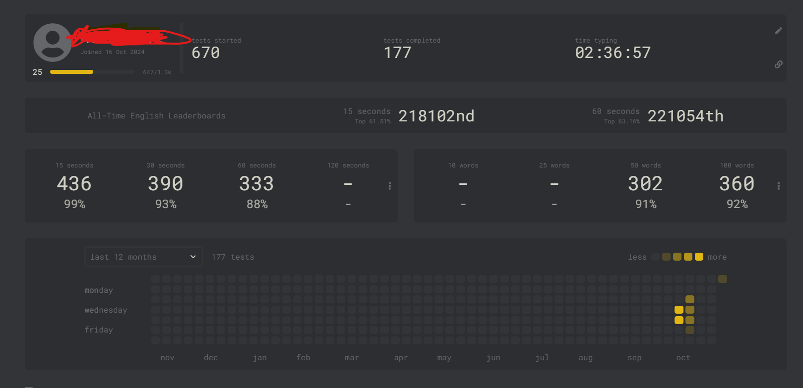

# 自我介绍

我是22计网1的,现在主学

- Java
- Linux
- 学校里学习的ENSP

这个md文件科能写的比较简陋,不过自我介绍应该是够了:)
没事的时候我喜欢打打字,目前最快436(15s)

网站是[monkeytype](www.monkeytype.com)
使用软件

- IDEA2024 社区版
    - 插件
        - ideavim
    - theme
        - dark(默认)
- 豆包AI
- Typora(现在选择在IDEA里面写)

# 关于这个仓库

这些是我学习Java的代码文件,发布在github上是为了便于复习和记录以下自己学习的东西

如果想学习我的代码(虽然写的不一定好),可以克隆我的仓库,如果有大佬可以提出issue的话,请务必提出来,这对我的进步很有用

> 说实话,有时候还好托管到了github仓库,否则我换电脑的时候就不会丢失我辛苦撸的代码:)

# 其他

喜欢可爱的东西:)